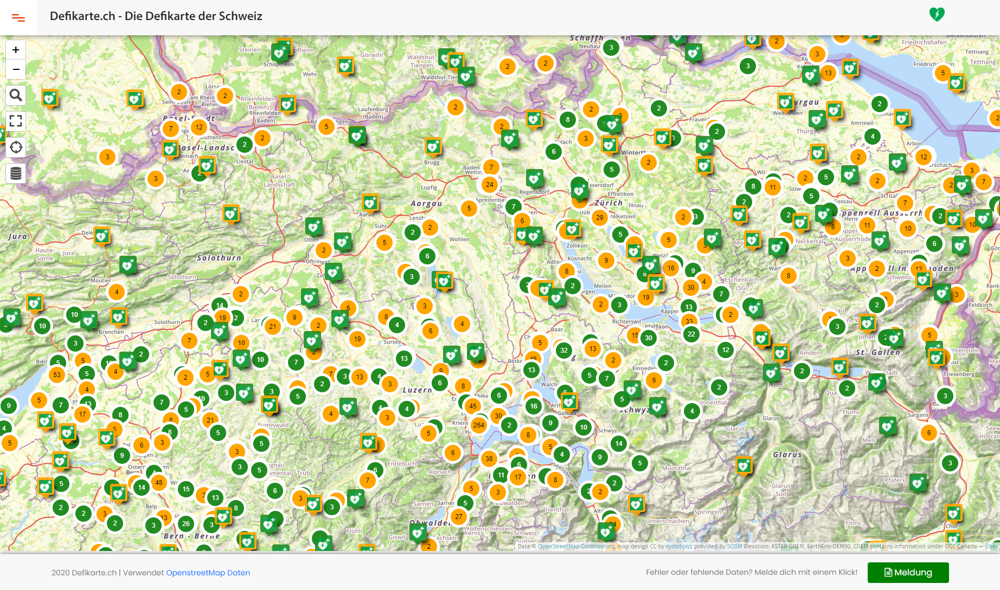

This Page is also available in English, please visit: [English 👈🏻](README_en.md)

## Idee und Umsetzung

Die Idee zu dieser Seite kam mir als ich im Kanton Graubünden durch ein verschlafenes Dörfchen fuhr und mir in regelmässigen Abständen, eine Tafel den nächsten Standort eines Defibrillators angezeigt hat.Mir wurde bewusst dass dies bei weitem nicht alle Kantone so handhaben und dass die Defi-Standorte meist unbekannt sind.

Danach ging ich auf die Suche der Daten bei meiner eigenen Gemeinde und bekam diese Infos. Ich habe dann die Daten in OpenStreetMap nachgetragen und in meiner Gemeinde waren nun Defibrillatoren gepflegt. Ich begann aber schnell auch über den Tellerrand zu schauen und wollte wissen wie die Datenbestände schweizweit aussehen. Bei der Datenabfrage hat mich das Ergebnis sehr überrascht und ich fand, diese Daten müsse man nützen. Ich fand zwei, drei Karten die mehr oder weniger manuell gepflegt wurden. Diese Methode fand ich zu umständlich und wollte dass meine Karte direkt von der Community-Datenpflege profitiert also habe ich die Defikarte.ch ins Leben gerufen.

Die Karte soll allen helfen, schnell und effizient einen Defibrillator zu finden in einer hektischen, nicht alltäglichen Situation.

Wichtig: Grün angezeigte Defi's sind 24h zugänglich. Orange angezeigte Defis sind mit Beschränkungen erreichbar.

## Daten

| Key | Value | Beschreibung |
| ----------- | ----------- | ----------- |
| emergency | defibrillator | Benennt einen Defibrillatorstandort
| defibrillator:location | z.B an einer Wand neben dem Eingang usw. | Ort des Defibrillators
| description | 24h verfügbar | Beschreibung zum Defi
| opening_hours | 24/7, effektive Öffnungszeiten oder leer | die Öffnungszeiten wann der Defi erreichbar ist
| access | yes/no/leer | Zugang zum Defi
| phone | Telefonnummer | Nummer der Notrufzentrale oder des Betreibers des Defi
| emergency:phone | 144 | Schweizweite Notrufnummer

### OpenStreetMap

OpenStreetMap® sind „Open Data“, die gemäß der Open Data Commons Open Database Lizenz (ODbL) durch die OpenStreetMap Foundation (OSMF) verfügbar sind.

Es steht dir frei unsere Daten zu kopieren, weiterzugeben, zu übermitteln sowie anzupassen, sofern du OpenStreetMap und die Mitwirkenden als Quelle angibst. Für den Fall, dass du auf Basis unserer Daten Anpassungen vornimmst, oder sie als Grundlage für weitere Bearbeitungen verwendest, kannst du das Ergebnis auch nur gemäß der selben Lizenz weitergeben. Der vollständige Lizenztext ist unter Lizenz einsehbar und erläutert deine Rechte und Pflichten.

Unsere Dokumentation ist unter der ''Creative-Commons''-Lizenz „Namensnennung – Weitergabe unter gleichen Bedingungen“ 2.0 (CC BY-SA 2.0) verfügbar.

Vollständiger Artikel: [https://www.openstreetmap.org/copyright](https://www.openstreetmap.org/copyright)

## Tools

Um die Daten aus Openstreetmap abzuholen werden folgende Tools verwendet:

### Overpass

Overpass API und dessen GUI Overpass Turbo ermöglicht es auf einfache Weise, Daten aus OpenStreetMap direkt abzurufen. Dazu ist kein Layer oder eine Zwischenspeicherung nötig.

Bekannte Endpoints für die API sind:

* [Overpass Turbo EU](https://overpass-turbo.eu/)
* [Overpass SOSM](https://overpass-turbo.osm.ch/)
* [weiterführende Links zu API Endpoints](https://wiki.openstreetmap.org/wiki/Overpass_API#Public_Overpass_API_instances)

#### Abfragen

Die Daten werden aus den Daten aus dem [Defi Archiv](https://github.com/chnuessli/defi_archive) generiert und in Umap dann dort angezeigt. 

***zeige alle Defis in der Schweiz***

```
/*
This has been generated by the overpass-turbo wizard.
The original search was:
“emergency=defibrillator in CH”
*/
[out:json][timeout:25];
nwr["emergency"="defibrillator"]["opening_hours"!="24/7"]; out center;
```

***zeige alle Defis in der Schweiz die 24h erreichbar sind***

```
/*
This has been generated by the overpass-turbo wizard.
The original search was:
“emergency=defibrillator and opening_hours="24/7" in CH”
*/
[out:json][timeout:25];
// fetch area “CH” to search in
{{geocodeArea:CH}}->.searchArea;
// gather results
(
  // query part for: “emergency=defibrillator and opening_hours="24/7"”
  node["emergency"="defibrillator"]["opening_hours"="24/7"](area.searchArea);
  way["emergency"="defibrillator"]["opening_hours"="24/7"](area.searchArea);
  relation["emergency"="defibrillator"]["opening_hours"="24/7"](area.searchArea);
);
// print results
out body;
>;
out skel qt;
```

### Umap

Die Karte selber ist per iframe eingebettet und ist eigentlich eine Umap Karte. Der Schweizer Ableger wird durch die SOSM verwaltet.

Umap findet man hier in [Github](https://github.com/umap-project/umap)

### App

Die App zu Defikarte.ch findet man in den Stores des jeweiligen Anbieters.

[](https://apps.apple.com/us/app/defikarte-ch/id1549569525)
[](https://play.google.com/store/apps/details?id=ch.defikarte.app)

## Presse

Diverse Presseberichte wurden über die Defikarte.ch erstellt. Die Nennungen waren durchwegs positiv, was mich sehr freut.

## Awards

***Nominierungen***

* DINACon Award [Shortlist der Kategorie Community Award](https://awards.dinacon.ch/shortlist-2020/)

## Sponsoren

### Gold Sponsoren

* [resQShock](https://www.procamed.ch)
* [First-Responder.ch](https://www.procamed.ch)
* [Nohe.ch](https://www.nohe.ch)

### Logo Sponsoren

* [Procamed AG](https://www.procamed.ch)
* [Ursula Dombrowsky Gesundheitspraxis](http://www.dombrowsky.ch)
* [Hexagon](http://www.hexagonsi.com)
* [WC Guide](https://www.wc-guide.com)
* [Github-User Malsendif](https://github.com/Malsendif)

## [Lizenz](LICENSE)

## Contributors

<a href="https://github.com/chnuessli/defikarte.ch/graphs/contributors">
  
</a>

Made with [contributors-img](https://contributors-img.web.app).

## Open Source

Open Source und Open Data ist einer der Grund-Manifeste der Defikarte.

Wir untersützen folgende Open Source Initiativen:

* [OpenData Swiss](https://opendata.swiss/de/)

**Code on**

